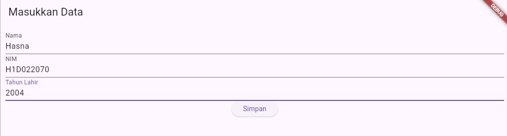
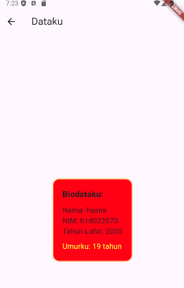

# Tugas Pertemuan 2

Fork dan clone repository ini, lalu jalankan perintah 
```
flutter pub get
```
Buatlah tampilan form yang berisi nama, nim, dan tahun lahir pada file `ui/form_data.dart`, lalu buatlah tampilan hasil dari input data tersebut pada file `ui/tampil_data.dart`

JELASKAN PROSES PASSING DATA DARI FORM MENUJU TAMPILAN DENGAN FILE `README.md`

Buat tampilan semenarik mungkin untuk dilihat.


Nama : Hasna Mumtazah Khairunnisa

NIM : H1D022070

Shift Baru: E

1. Input data: Pengguna mengisi form pada halaman form_data.dart.
2. Mengambil data: Kemudian data diambil dari form menggunakan TextEditingController.
3. Navigasi data: Data dikirimkan ke tampil_data.dart melalui Navigator.push, yang selanjutnya akan dikirimkan sebagai parameter.
4. Tampilan data: Data diterima di tampil_data.dart melalui konstruktor dan ditampilkan pada halaman hasil.

## Screenshot
Contoh :


